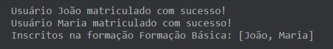

# Aprenda Kotlin Com Exemplos: Desafio de Projeto (Lab)

Desafio de Projeto criado para avaliação do conteúdo técnico explorado no repositório [aprenda-kotlin-com-exemplos](https://github.com/digitalinnovationone/aprenda-kotlin-com-exemplos). **Nesse contexto, iremos abstrair o seguinte domínio de aplicação:**

**A [DIO](https://web.dio.me) possui `Formacoes` incríveis que têm como objetivo oferecer um conjunto de `ConteudosEducacionais` voltados para uma stack tecnológica específica, preparando profissionais de TI para o mercado de trabalho. `Formacoes` possuem algumas características importantes, como `nome`, `nivel` e seus respectivos `conteudosEducacionais`. Além disso, tais experiências educacionais têm um comportamento relevante ao nosso domínio, definido pela capacidade de `matricular` um ou mais `Alunos`.**


```kotlin
TODO("Crie uma solução em Kotlin abstraindo esse domínio. O arquivo [desafio.kt] te ajudará 😉")
```

</br>

# Solução do Desafio

## Acesse esse link do Kotlin Playground e veja a solução:

`https://pl.kotl.in/Wzc8DQOmr`

### Saída:

<p align="center">
  
</p>

## 📝 License

<p align="center">
  
</p>
<p align="center">Esse projeto está sob a licença MIT.</p>

<br>

### 👨‍💻 Autor

 
 <em>Ciro Batista da Silva<em>
 
 <br/>

 <p>👋🏽 Entre em contato!</p>

[](https://twitter.com/CiroSilva2020) [](https://www.linkedin.com/in/ciro-batista-da-silva-8b6838205/)
[](mailto:cirofight@gmail.com)
